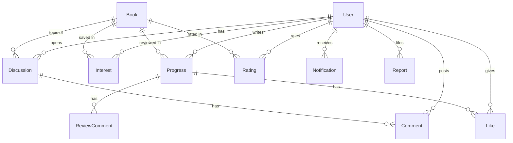

# 데이터베이스 스키마

> 원본: [server/prisma/schema.prisma](../../server/prisma/schema.prisma). 이 문서는 사람이 빠르게 파악하기 위한 정리본.

## 개요
- **ORM:** Prisma. **로컬 = SQLite**(`server/prisma/dev.db`), **배포 = PostgreSQL**.
  - 빌드 시 `server/scripts/use-postgres.mjs`가 `provider`를 `sqlite → postgresql`로 자동 전환. → `schema.prisma`의 provider는 항상 **sqlite로 커밋**.
- **마이그레이션:** 별도 migrations 폴더 없이 **`prisma db push`**(스키마 → DB 직접 반영). 배포 빌드는 `db push --accept-data-loss`.
- **ID:** 모든 테이블 PK는 `cuid()` 문자열.
- **시드:** `server/prisma/seed.ts` (프로덕션은 데모 비번 랜덤 — 보안 감사 반영).

## ER 관계 (핵심)

## 모델 상세

### User — 회원
| 필드 | 타입 | 설명 |
|------|------|------|
| id | String PK | cuid |
| username | String **unique** | 로그인 아이디 |
| email | String? **unique** | 이메일 인증 가입(중복 불가). 기존 계정 null |
| name | String | 이름(비공개) |
| nickname | String? **unique** | 활동 표시명. 없으면 name 폴백 |
| phone | String? | 휴대폰 |
| agreedAt | DateTime? | 개인정보 동의 시각 |
| provider / providerId | String? | 소셜 로그인('kakao'\|'google') 식별. `@@unique([provider, providerId])` |
| passwordHash | String | bcrypt (소셜 전용 계정은 사용 불가 랜덤값) |
| isAdmin | Boolean | 관리자(서버 통제 컬럼) |
| suspended | Boolean | 활동 정지 → 로그인·인증 차단 |
| avatar / birthYear / lastSeenAt / createdAt | | 아바타·출생연도·마지막접속·가입일 |

- 관계: progresses, interests, discussions, comments, likes, notifications, reviewComments, reports, recoExclusions, ratings

### EmailVerification — 이메일 인증 대기
가입 확정 전 임시 저장. 인증 성공 시 User로 승격 후 삭제. `email` unique, `code`(6자리), `expiresAt`(10분).

### Notice — 공지사항
관리자만 작성·수정·삭제(모두 열람). `title`·`body`·`pinned`(고정)·createdAt·updatedAt.

### Feedback — 피드백/버그 신고
비로그인 허용 → User와 **하드 관계 없음**(userId는 참고용, `name` 제출 시점 저장). `kind`('feedback'|'bug'), `resolved`.

### Book — 책
title/author/cover/genre/category/publisher/description. `isbn` unique(임포트 중복 방지, 수동추가 null). genre·category는 콘텐츠 기반 추천용.

### Progress — 독서 기록 + 서평
책 1권에 여러 번 기록(날짜별 이력). `bookSeq`(그 책 안 순번, URL용 — **max+1로 부여**, 삭제 후 충돌 방지), startPage/endPage/note/quote/rating. `@@index([userId, bookId])`. → ReviewComment·Like (onDelete Cascade).

### ReviewComment — 서평 댓글
progressId→Progress(**Cascade**), userId→User.

### Like — 서평 좋아요
`@@unique([userId, progressId])`, progressId→Progress(**Cascade**).

### Report — 신고
targetType('review'|'discussion')+targetId. `@@unique([reporterId, targetType, targetId])`(1인 1신고), `@@index([targetType, targetId])`.

### Notification — 알림
받는 사람 userId, type('comment'|'like'), message, link, read. `@@index([userId])`.

### Rating — 책 별점
사용자 1명당 책 1개(`@@unique([userId, bookId])`). 서평이 아니라 **책 자체**에 매김.

### RecoExclusion — 추천 제외
사용자별 '추천 안 받을 책'. `@@unique([userId, bookId])`.

### Interest — 관심 책(내 서재)
`@@unique([userId, bookId])`. 서평 작성은 이 서재에 담은 책만 가능(프론트 게이팅).

### Discussion — 토론
읽은 책만 개설(ownerId). bookId→Book. → Comment.

### Comment — 토론 댓글
discussionId→Discussion(**Cascade**), userId→User. 누구나 작성.

## 제약·인덱스 요약
- **unique:** User(username, email, nickname, [provider,providerId]), Book(isbn), EmailVerification(email), Like[userId,progressId], Rating/Interest/RecoExclusion[userId,bookId], Report[reporterId,targetType,targetId]
- **index:** Progress[userId,bookId], Report[targetType,targetId], Notification[userId]
- **onDelete Cascade:** ReviewComment·Like ← Progress, Comment ← Discussion

## 삭제(회원 탈퇴) 처리
`auth_repository.deleteUserCascade`가 트랜잭션으로 like→comment→reviewComment→notification→interest→progress→discussion→user 순 삭제(내 서평의 좋아요·댓글, 내 토론의 댓글은 Cascade). Rating/RecoExclusion/Report 등은 FK 특성상 별도 고려 대상(향후 정리 여지).

## 주의 (gotcha)
- provider는 항상 sqlite로 커밋(배포 빌드가 전환).
- 스키마 변경은 `npm run db:push`(로컬) / 배포 빌드가 자동 push. 추가 필드는 nullable/default로 무중단.
